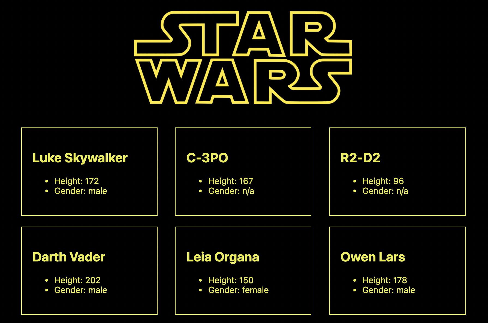
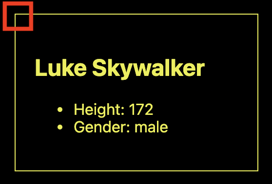
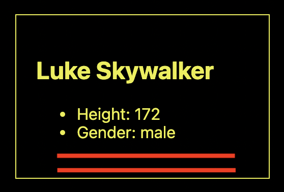

This is a [Next.js](https://nextjs.org/) project bootstrapped with [`create-next-app`](https://github.com/vercel/next.js/tree/canary/packages/create-next-app).

## Getting Started

First, run the development server:

```bash
npm run dev
```

Open [http://localhost:3000](http://localhost:3000) with your browser to see the result.



You can start editing the page by modifying `pages/index.js`. The page auto-updates as you edit the file.

The application leverages API to fetch information about Star Wars charracters. More info can by found here [https://swapi.dev/](https://swapi.dev/).

## Tasks

- Make boxes with round corners



- Change font color and border colors from yellow to white
- Add hair color and skin color information for each character
- Show name of characters' starship



